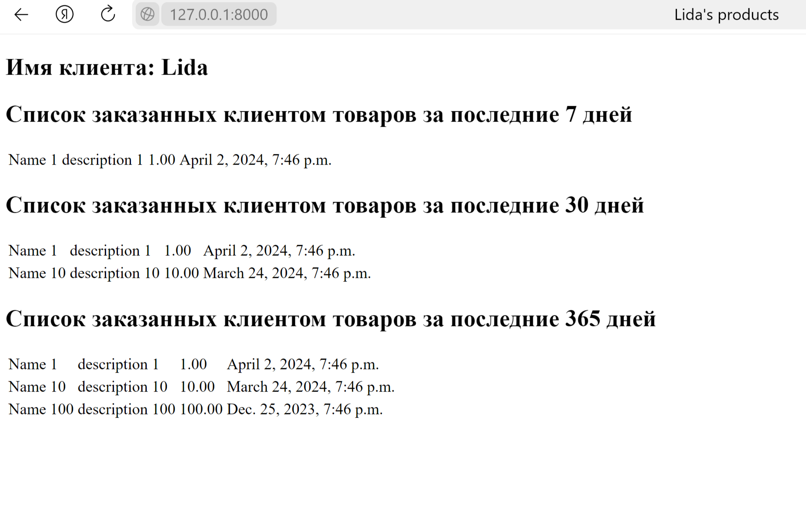

Установить зависимости:

    pip install requirements.txt

Запуск сервера:

    cd .\myproject\  
    python manage.py runserver 

Логи:
    
    myproject/django.log

1. Задание

Создайте пару представлений в вашем первом приложении:
— главная
— о себе.

Внутри каждого представления должна быть переменная html — многострочный текст с HTML-вёрсткой и данными о вашем первом Django-сайте и о вас.

Сохраняйте в логи данные о посещении страниц.

2. Задание

Создайте три модели Django: клиент, товар и заказ.

Клиент может иметь несколько заказов. Заказ может содержать несколько товаров. Товар может входить в несколько заказов.

Поля модели «Клиент»:
— имя клиента
— электронная почта клиента
— номер телефона клиента
— адрес клиента
— дата регистрации клиента

Поля модели «Товар»:
— название товара
— описание товара
— цена товара
— количество товара
— дата добавления товара

Поля модели «Заказ»:
— связь с моделью «Клиент», указывает на клиента, сделавшего заказ
— связь с моделью «Товар», указывает на товары, входящие в заказ
— общая сумма заказа
— дата оформления заказа

Допишите несколько функций CRUD для работы с моделями по желанию. Что по вашему мнению актуально в такой ба

3. Задание

Продолжаем работать с товарами и заказами.

Создайте шаблон, который выводит список заказанных клиентом товаров из всех его заказов с сортировкой по времени:
— за последние 7 дней (неделю)
— за последние 30 дней (месяц)
— за последние 365 дней (год)

Товары в списке не должны повторятся.

python manage.py create_fake_order
python manage.py runserver

http://127.0.0.1:8000/les3/products/Lida/

4. Задание

Измените модель продукта, добавьте поле для хранения фотографии продукта.

Создайте форму, которая позволит сохранять фото.